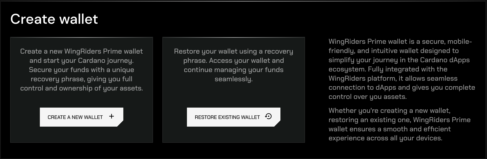
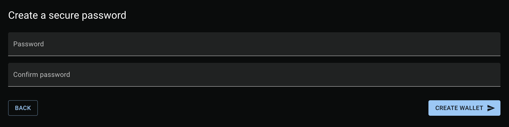
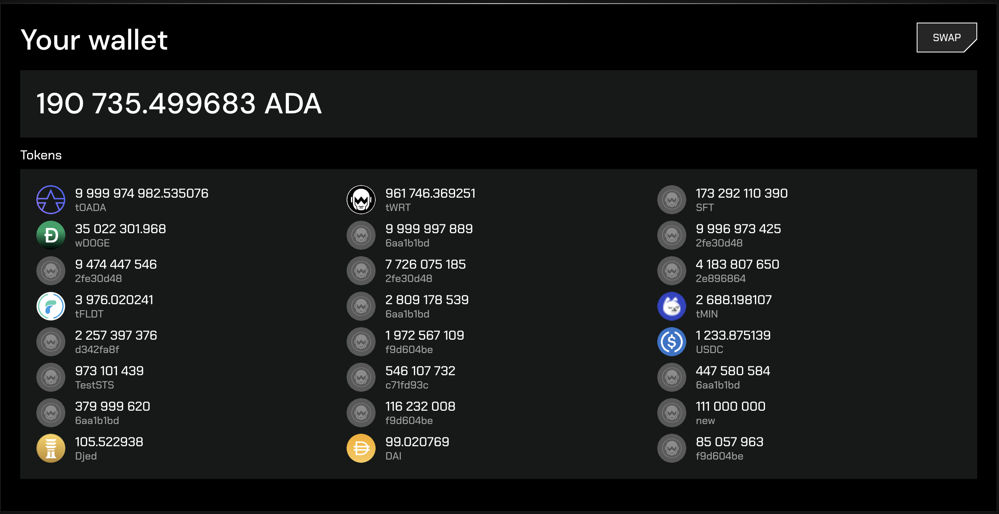
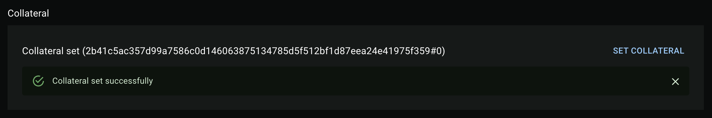
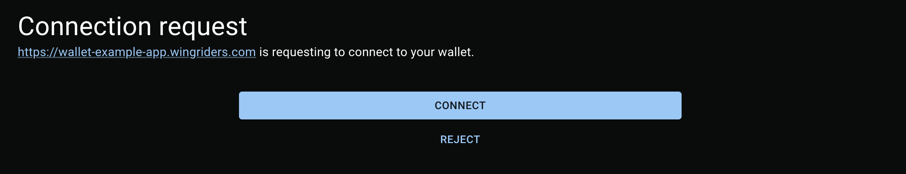
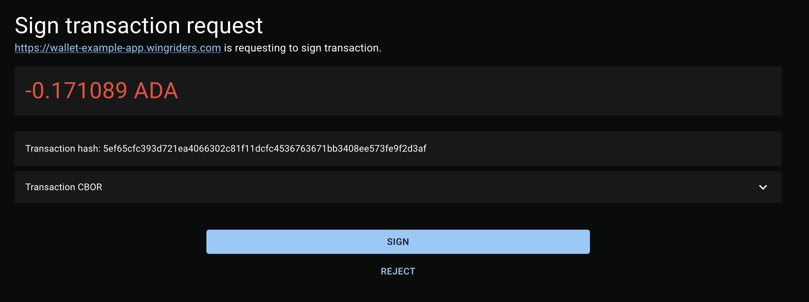

# WingRiders Wallet Gateway Application

The WingRiders Wallet Gateway is a web application that allows users to manage their wallet and interact with dApps for signing transactions and providing necessary data.

You can access the Wallet Gateway application at [https://wallet.wingriders.com](https://wallet.wingriders.com).

## Application Manual

### Create a New Wallet

When you first visit the application, you will be prompted to create a wallet:

You have two options:

1. **Create a new wallet**: The application will generate a new mnemonic, and a brand new wallet will be created.
2. **Import an existing wallet**: Choose this option if you already have a mnemonic for an existing wallet that you want to import.

After entering your mnemonic (or generating a new one), you will be prompted to create a secure password:

This password will be required for all wallet-related actions, such as signing in to the application or signing transactions. Ensure you choose a strong and secure password.

Once you’ve set your password, the application will create your wallet.

### Wallet Data

On the home screen, you can view your wallet data, including your balance, address, and collateral:

### Creating Collateral

To interact with Cardano smart contracts, you must provide collateral. This is typically 5 ADA and is returned when the smart contract transaction is successfully executed.

To create collateral, click the `SET COLLATERAL` button and enter your password. After signing and submitting the transaction, you will see the collateral UTxO ID:

### Connecting to dApps

When a dApp requests a connection to your wallet, a new window of the WingRiders Wallet Gateway will open, where you can accept the connection request:

### Signing Transactions

When a dApp requests to sign a transaction with your wallet, a new window of the WingRiders Wallet Gateway will open, allowing you to sign the transaction:

