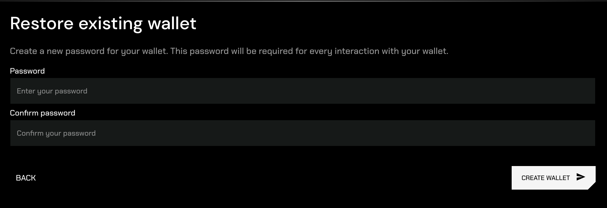
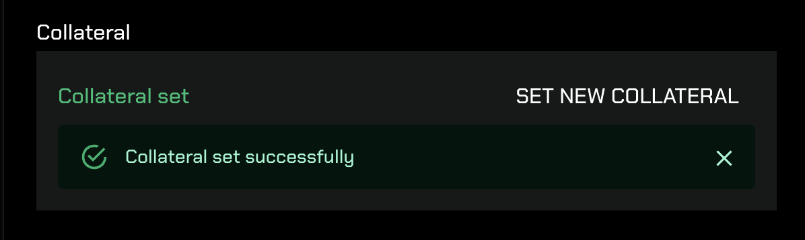
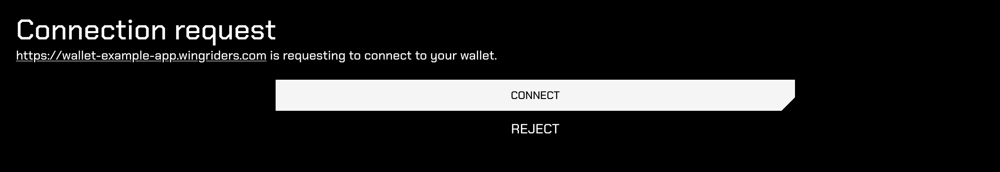
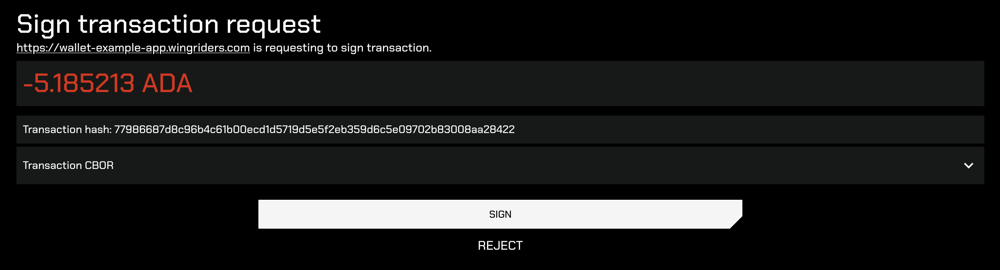
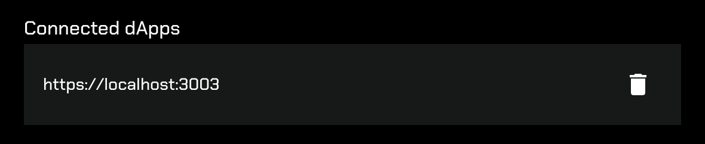

# WingRiders Wallet Gateway Application

The WingRiders Wallet Gateway is a web application that allows users to manage their wallet and interact with dApps for signing transactions and providing necessary data.

You can access the Wallet Gateway application at [https://wallet.wingriders.com](https://wallet.wingriders.com).

## Application Manual

### Create a New Wallet

When you first visit the application, you will be prompted to create a wallet:

You have two options:

1. **Create a new wallet**: The application will generate a new mnemonic, and a brand new wallet will be created.
2. **Restore existing wallet**: Choose this option if you already have a mnemonic for an existing wallet that you want to import.

After entering your mnemonic (or generating a new one), you will be prompted to create a secure password:

This password will be required for all wallet-related actions, such as signing in to the application or signing transactions. Ensure you choose a strong and secure password.

Once you’ve set your password, the application will create your wallet.

### Wallet Data

On the home screen, you can view your wallet balance - ADA and tokens:

### Creating Collateral

To interact with Cardano smart contracts, you must provide collateral. This is typically 5 ADA and is returned when the smart contract transaction is successfully executed.

To create collateral, click the account button in the top right corner and then the `SET COLLATERAL` button. Then enter your password. After signing and submitting the transaction, you will see the collateral UTxO ID:

### Connecting to dApps

When a dApp requests a connection to your wallet, a new window of the WingRiders Wallet Gateway will open, where you can accept the connection request:

### Signing Transactions

When a dApp requests to sign a transaction with your wallet, a new window of the WingRiders Wallet Gateway will open, allowing you to sign the transaction:

### Connected dApps

If a dApp initiates a connection request to your wallet ([Connecting to dApps](#connecting-to-dapps)) and you accept it, the dApp will be added to the list of connected dApps in your wallet.

Your wallet will only process signing requests from connected dApps. If a transaction signing request comes from a dApp that is not in the connected dApps list, the wallet will ignore it.

You can view the list of connected dApps by opening your account details in the top-right corner. To remove a connected dApp, simply click the bin icon next to it.

## Troubleshooting

### I cannot create a collateral

When you click on the `Set collateral` option, the wallet sends 5 ADA to your address. To successfully create collateral, ensure you have at least 6 ADA in your wallet—5 ADA for the collateral plus a small amount for transaction fees.

### I cannot connect to the wallet from a dApp

When you initiate a wallet connection from a dApp, a new browser window opens. Sometimes, browsers block these windows. Ensure that pop-ups are enabled in your browser settings.

### I don't see my balance in the wallet

The wallet automatically fetches UTxOs from all your used addresses on the network. Ensure you have selected the correct network. If the problem persists, try discarding your wallet and importing it again.

### I cannot interact with my dApp's smart contract

If a dApp prompts you to sign a transaction involving a smart contract execution, you will need to provide a collateral UTxO (typically 5 ADA) in the transaction. This UTxO is only spent if the smart contract execution fails. Make sure you have collateral set in the wallet.
